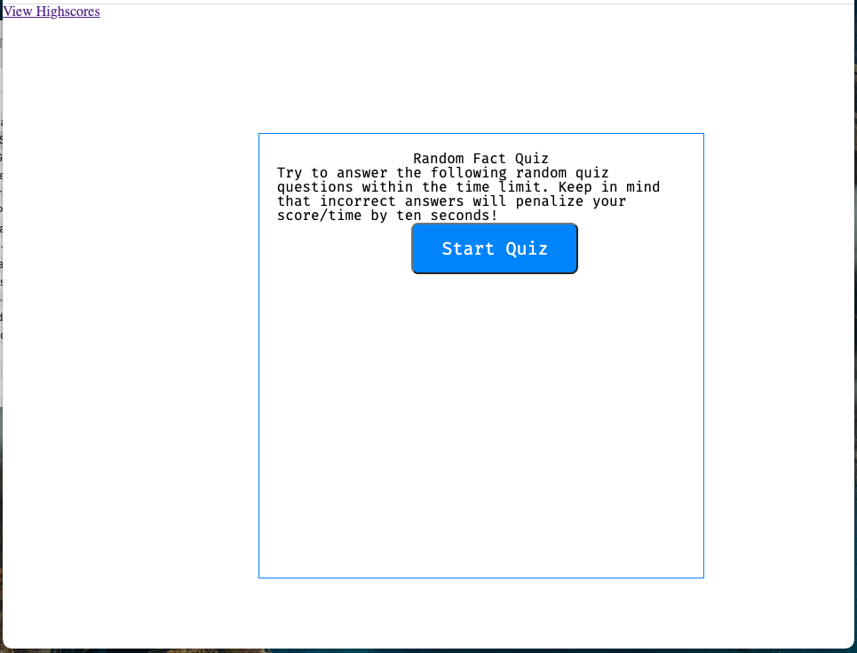
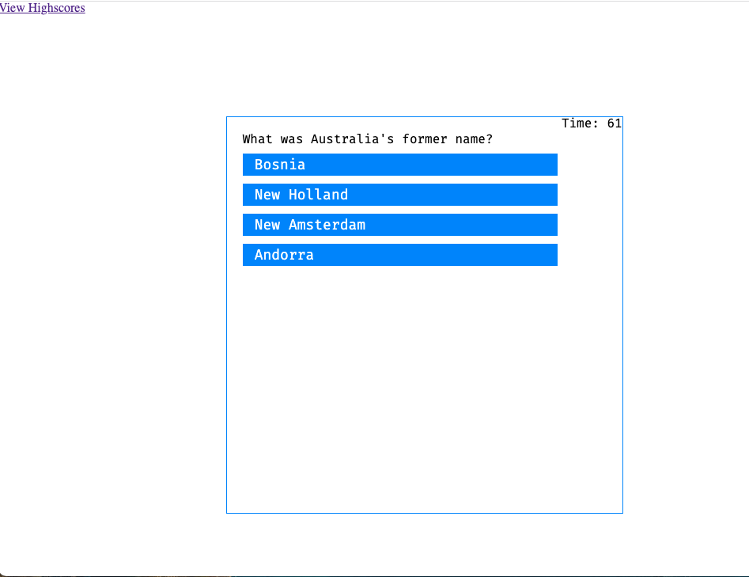
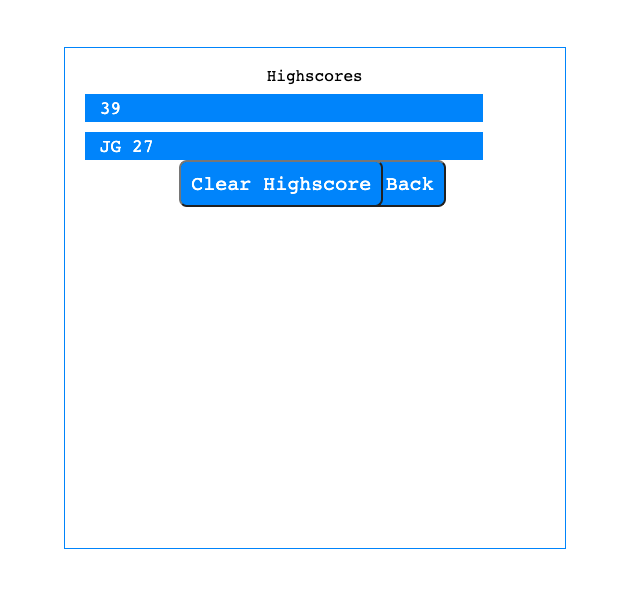

# Timed-Coding-Quiz

#Purpose: For students to create a timed quiz that will log the highscores within the local storage, leveraging Javascript, HTML, and CSS.

Link to deployed website: https://jrgartner.github.io/Timed-Coding-Quiz/index.html
Link to GitHub Code: https://github.com/jrgartner/Timed-Coding-Quiz

Screenshots of deployed website:

